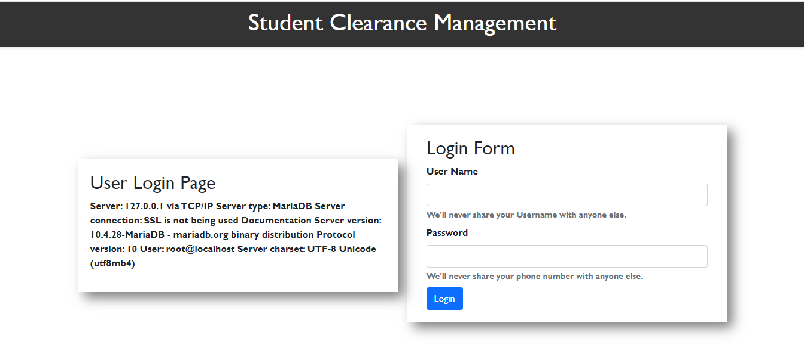
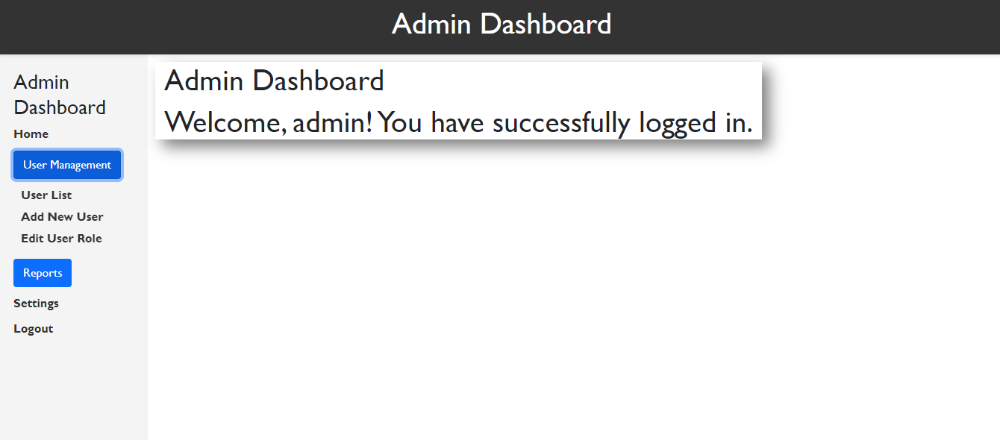
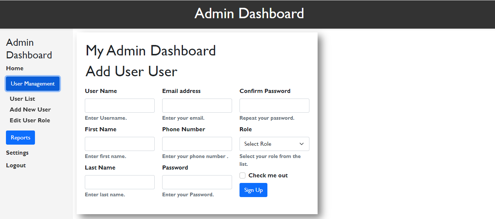
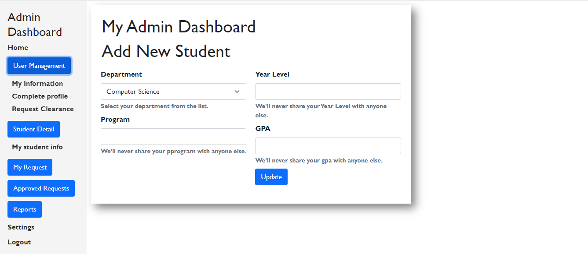
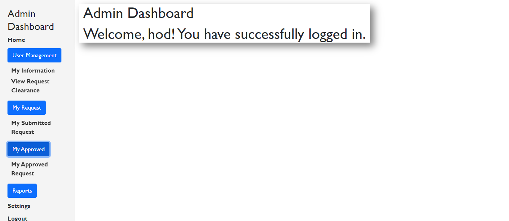
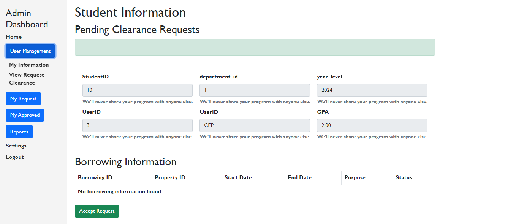
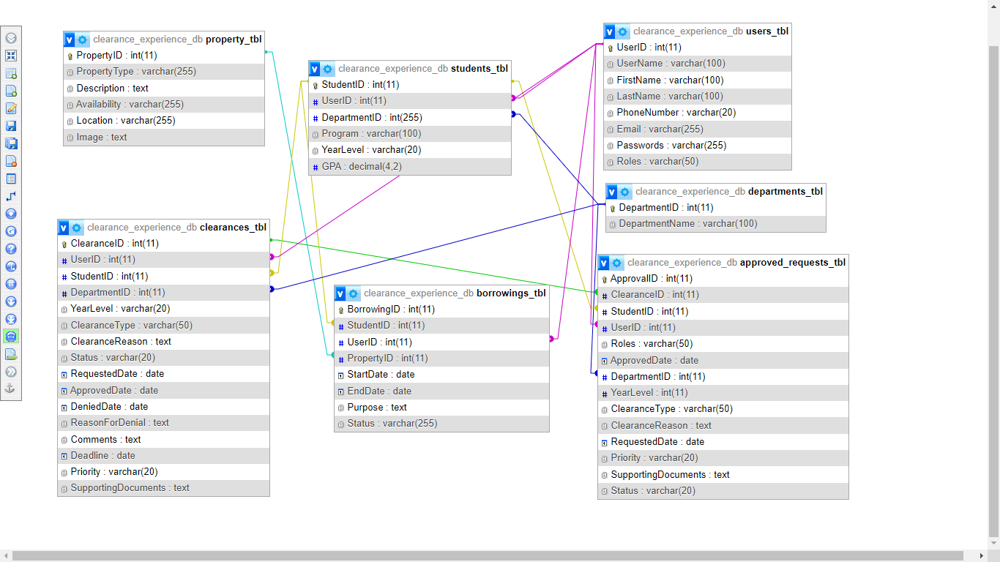

# clearances_experiences
 This is simple a repository descriptions

<h1> Login Page </h1>

 <strong>Username: </strong>  <strong>Password </strong>

 <strong> admin         </strong>  <strong>   admin </strong>

 <strong> hod           </strong>  <strong>     hod </strong>

 <strong> kabe           </strong>  <strong>     kabe </strong>

<h1> Admin Page </h1>

username:admin

<>Password:admin

<h3> Some information of the admin page </h3>

<h3> Some information of the admin page </h3>

<h3> Some information of the admin page </h3>

<h1> Student Page </h1>

username:bedasa1

<>Password:password

<h1> HOD Page </h1>

username:hod

<>Password:hod

<h3> Some information of the HOD page </h3>

<h3> Some information of the HOD page </h3>

<h1> Database Design  </h1>

